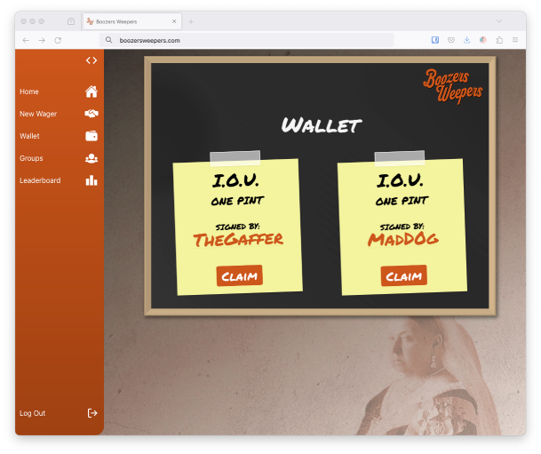

# Boozers Weepers
<div align="center">
  
</div>


This branch represents an extension of [Team Tavern](https://github.com/Catherine-Russell/TeamTavern), developed in collaboration between [Sam Ford](https://github.com/Fordcois) & [Rachel Roberts](https://github.com/Rachel853). The modifications made to this branch focus on styling and refactoring the code structure.

Originally, the project was executed within a two-week timeframe, building upon a legacy codebase. It features the contributions of myself, [Rachel Roberts](https://github.com/Rachel853), [Ben Dixon](https://github.com/BenDixon96), and [Catherine Russell](https://github.com/Catherine-Russell), with [Karys Barbrook](https://github.com/karysbarbrook) and [Manuela Iacobovici](https://github.com/ManuelaIacobovici) serving as quality engineers for the project.

## Features

**BoozersWeepers** is a lifestyle web application for tracking and settling informal pub bets and IOUs between friends.

<div align="center">
  
  

</div>

🟠 **User Registration and Secure Login:** Users can easily register accounts with unique credentials and securely log in to the platform.

🟠 **Live User Search:** Utilise live search functionality to find other users on the platform by their unique username or real name, facilitating challenges for wagers.

🟠 **Wager Challenges:** Users can initiate wager challenges, specifying win conditions and deadlines. They can also review incoming wager requests and approve or deny them before commitments are finalised.

🟠 **Deadline Notifications:** Users receive notifications when wager deadlines are up. After the deadline, users are prompted to select a winner, with the victor receiving an IOU for a pint, stored securely in their Wallet.

🟠 **Wallet Management:** View and claim pints won from successful bets through the user's Wallet.


🟠 **Global Leaderboard:** Explore the site's top performers with a dynamic leaderboard showcasing the top 10 users based on win percentages, the user with the highest won pint count, and the person who owes the most outstanding pints.

🟠 **Friend Groups:** Create and join friend groups, allowing users to track the bets of other group members.

## Technology Stack
<br>


## Set up 

1. Install Node.js dependencies for both the `frontend` and `api` directories.
   ```
   ; cd api
   ; npm install
   ; cd ../frontend
   ; npm install
   ```

2. Install an ESLint plugin for your editor. For example: [`linter-eslint`](https://github.com/AtomLinter/linter-eslint) for Atom.

3. Install MongoDB
   ```
   brew tap mongodb/brew
   brew install mongodb-community@5.0
   ```
   *Note:* If you see a message that says `If you need to have mongodb-community@5.0 first in your PATH, run:`, follow the instruction. Restart your terminal after this.
4. Start MongoDB
   ```
   brew services start mongodb-community@5.0
   ```

### How to run the server and use the app 
1. Start the server application (in the `api` directory)

  **Note the use of an environment variable for the JWT secret**
   ```
   ; cd api
   ; JWT_SECRET=f6d278bb34e1d0e146a80b16ec254c05 npm start
   ```
2. Start the front end application (in the `frontend` directory)
  In a new terminal session...
  ```
  ; cd frontend
  ; npm start
  ```

You should now be able to open your browser and go to `http://localhost:3000/` 

### How to run automated tests
The automated tests run by sending actual HTTP requests to the API. Therefore, before anything, you'll need to start the backend server in test mode (so that it connects to the test DB).

**Note the use of an environment variable for the JWT secret**
```bash
# Make sure you're in the api directory
; cd api
; JWT_SECRET=f6d278bb34e1d0e146a80b16ec254c05 npm run start:test
```

You should leave this running in a terminal.

Then, you can either run tests for the backend or the frontend following the steps below. 

### Running tests for the backend

Run the tests in a new terminal session:
```bash
# Make sure you're in the api directory
; cd api
; JWT_SECRET=f6d278bb34e1d0e146a80b16ec254c05 npm run test
```

###  Running tests for the frontend

Start the front end in a new terminal session
```bash
# Make sure you're in the frontend directory
; cd frontend
; JWT_SECRET=f6d278bb34e1d0e146a80b16ec254c05 npm start
```

Then run the tests in a new terminal session
```bash
# Make sure you're in the frontend directory
; cd frontend
; JWT_SECRET=f6d278bb34e1d0e146a80b16ec254c05 npm run test
```
